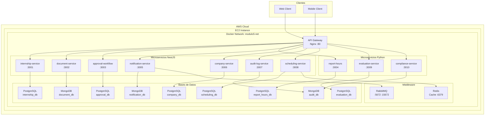

# Smart Campus UCE — Modulo 5

Vinculacion con la Sociedad y Practicas Preprofesionales

## Descripcion

Sistema de gestion de practicas preprofesionales que permite a los estudiantes solicitar, documentar y dar seguimiento a sus practicas, con flujo de aprobacion multinivel, registro de horas y evaluacion.

## Arquitectura

Proyecto gestionado como **monorepo** con **pnpm workspaces**, compuesto por **10 microservicios** polyglot (NestJS + Python FastAPI), orquestados con Docker Compose y desplegados en AWS con Terraform.



## Microservicios

| # | Servicio | Stack | Puerto | Base de Datos | Descripcion |
|---|---|---|---|---|---|
| 1 | **internship-service** | NestJS + TypeORM + PostgreSQL | 3001 | internship_db | Gestion de practicas y registro de horas |
| 2 | **document-service** | NestJS + Mongoose + MongoDB | 3002 | document_db | Subida, validacion y almacenamiento de documentos |
| 3 | **approval-workflow** | NestJS + TypeORM + PostgreSQL + RabbitMQ + PDFKit | 3003 | approval_db | Flujo de aprobacion multinivel (tutor -> coordinador -> decano) |
| 4 | **report-hours** | Python FastAPI + SQLAlchemy + PostgreSQL + Redis | 3004 | report_hours_db | Consolidacion de horas y generacion de certificados PDF |
| 5 | **notification-service** | NestJS + Mongoose + MongoDB + RabbitMQ + WebSocket | 3005 | notification_db | Notificaciones en tiempo real via REST, WebSocket y RabbitMQ |
| 6 | **company-service** | NestJS + TypeORM + PostgreSQL | 3006 | company_db | Catalogo de empresas con convenios |
| 7 | **audit-log-service** | NestJS + Mongoose + MongoDB | 3007 | audit_db | Registro de auditoria del sistema |
| 8 | **scheduling-service** | NestJS + TypeORM + PostgreSQL + Redis | 3008 | scheduling_db | Gestion de horarios con cache |
| 9 | **evaluation-service** | Python FastAPI + SQLAlchemy + PostgreSQL | 3009 | evaluation_db | Evaluaciones de desempeno de estudiantes |
| 10 | **compliance-service** | Python FastAPI + PyMongo + MongoDB | 3010 | compliance_db | Control de cumplimiento de requisitos |

## Stack Tecnologico

| Categoria | Tecnologias |
|---|---|
| Backend | NestJS 11, Python FastAPI, TypeORM, Mongoose, SQLAlchemy |
| Frontend | Web Client (pendiente) |
| Bases de Datos | PostgreSQL 16 (5 instancias), MongoDB 7 (3 instancias) |
| Cache | Redis 7 |
| Message Broker | RabbitMQ 3 |
| API Gateway | Nginx Alpine |
| Infraestructura | Docker, Docker Compose, Terraform (AWS) |
| Cloud | AWS EC2, VPC, ALB, Auto Scaling Group, Elastic IP |
| CI/CD | GitHub Actions, Docker Hub |
| Documentacion | Swagger/OpenAPI (runtime) |

## Principios de Diseno

El proyecto aplica los siguientes principios de diseno (documentados en `docs/DESIGN-PRINCIPLES.md`):

- **SOLID** - Single Responsibility, Open/Closed, Liskov Substitution, Interface Segregation, Dependency Inversion
- **DRY** - No Repeat Yourself
- **KISS** - Keep It Simple, Stupid
- **YAGNI** - You Aren't Gonna Need It
- **Low Coupling** - Servicios independientes con comunicacion via REST/RabbitMQ
- **High Cohesion** - Cada servicio agrupa logica relacionada

## Estructura del Monorepo

```
smart-campus-uce-modulo5/
├── apps/
│   ├── internship-service/        # NestJS + PostgreSQL (3001)
│   ├── document-service/          # NestJS + MongoDB (3002)
│   ├── approval-workflow/         # NestJS + PostgreSQL + RabbitMQ (3003)
│   ├── report-hours/              # Python FastAPI + PostgreSQL (3004)
│   ├── notification-service/      # NestJS + MongoDB + WebSocket (3005)
│   ├── company-service/           # NestJS + PostgreSQL (3006)
│   ├── audit-log-service/         # NestJS + MongoDB (3007)
│   ├── scheduling-service/        # NestJS + PostgreSQL + Redis (3008)
│   ├── evaluation-service/        # Python FastAPI + PostgreSQL (3009)
│   └── compliance-service/        # Python FastAPI + MongoDB (3010)
├── docker/
│   ├── docker-compose.yml         # Orquestacion de 21 contenedores
│   └── nginx/
│       ├── Dockerfile             # API Gateway
│       └── nginx.conf             # Reverse proxy config
├── Terraform/
│   ├── main.tf                    # Dev (EC2 + VPC + EIP)
│   ├── prod/
│   │   └── main.tf                # Prod (ALB + ASG + EC2)
│   └── qa/
│       └── main.tf                # QA (EC2 + EIP)
├── .github/
│   └── workflows/
│       ├── ci.yml                 # CI: Build + Test
│       ├── deploy.yml             # CD: Docker + SSH Deploy
│       └── test.yml               # Tests dedicados
├── docs/                          # Documentacion del proyecto
├── package.json                   # Root monorepo scripts
├── pnpm-workspace.yaml            # Config workspaces
├── CONTRIBUTING.md                # Guia de contribution
├── CHANGELOG.md                   # Registro de cambios
└── README.md                      # Este archivo
```

## Comandos del Monorepo

```bash
# Ejecutar todos los servicios en paralelo
pnpm run dev

# Construir todos los servicios
pnpm run build

# Ejecutar pruebas de todos los servicios
pnpm run test

# Ejecutar linter
pnpm run lint

# Listar servicios del monorepo
pnpm ls -r --depth -1
```

## Docker Compose

Para ejecutar todos los servicios:

```bash
docker compose -f docker/docker-compose.yml up -d
```

### Contenedores (21 total)

| Contenedor | Imagen | Puerto | Tipo |
|---|---|---|---|
| internship-db | postgres:16-alpine | 5432 | Base de datos |
| document-db | mongo:7 | 27017 | Base de datos |
| approval-workflow-db | postgres:16-alpine | 5433 | Base de datos |
| report-db | postgres:16-alpine | 5434 | Base de datos |
| company-db | postgres:16-alpine | 5435 | Base de datos |
| audit-db | mongo:7 | 27018 | Base de datos |
| scheduling-db | postgres:16-alpine | 5436 | Base de datos |
| evaluation-db | postgres:16-alpine | 5437 | Base de datos |
| notification-db | mongo:7 | 27019 | Base de datos |
| redis | redis:7-alpine | 6379 | Cache |
| rabbitmq | rabbitmq:3-management | 5672/15672 | Message Broker |
| internship-service | camaisincho/internship-service:latest | 3001 | Microservicio |
| document-service | camaisincho/document-service:latest | 3002 | Microservicio |
| approval-workflow | camaisincho/approval-workflow:latest | 3003 | Microservicio |
| report-hours | camaisincho/report-hours:latest | 3004 | Microservicio |
| notification-service | camaisincho/notification-service:latest | 3005 | Microservicio |
| company-service | camaisincho/company-service:latest | 3006 | Microservicio |
| audit-log-service | camaisincho/audit-log-service:latest | 3007 | Microservicio |
| scheduling-service | camaisincho/scheduling-service:latest | 3008 | Microservicio |
| evaluation-service | camaisincho/evaluation-service:latest | 3009 | Microservicio |
| compliance-service | camaisincho/compliance-service:latest | 3010 | Microservicio |
| api-gateway | camaisincho/api-gateway:latest | 80 | API Gateway |

## Endpoints por Servicio

### internship-service (:3001)
| Metodo | Endpoint | Descripcion |
|---|---|---|
| POST | /api/v1/internship | Crear solicitud de practica |
| GET | /api/v1/internship | Listar todas las practicas |
| GET | /api/v1/internship/:id | Obtener detalle de una practica |
| GET | /api/v1/internship/student/:studentId | Practicas de un estudiante |
| PUT | /api/v1/internship/:id | Actualizar practica |
| DELETE | /api/v1/internship/:id | Eliminar practica |
| POST | /api/v1/internship/:id/hours | Registrar horas diarias |
| GET | /api/v1/internship/:id/hours | Ver horas registradas |
| DELETE | /api/v1/internship/:id/hours/:hourId | Eliminar registro de horas |

### document-service (:3002)
| Metodo | Endpoint | Descripcion |
|---|---|---|
| POST | /api/v1/document/upload | Subir documento (multipart/form-data) |
| GET | /api/v1/document/:id | Descargar documento |
| GET | /api/v1/document/internship/:internshipId | Documentos de una practica |
| DELETE | /api/v1/document/:id | Eliminar documento |

### approval-workflow (:3003)
| Metodo | Endpoint | Descripcion |
|---|---|---|
| POST | /api/v1/approval/start | Iniciar flujo de aprobacion |
| GET | /api/v1/approval | Listar todas las aprobaciones |
| GET | /api/v1/approval/:id | Obtener aprobacion por ID |
| GET | /api/v1/approval/status/:internshipId | Estado por practica |
| PUT | /api/v1/approval/:id/approve | Aprobar (avanza paso) |
| PUT | /api/v1/approval/:id/reject | Rechazar |

### report-hours (:3004)
| Metodo | Endpoint | Descripcion |
|---|---|---|
| POST | /reports/students | Registrar estudiante (validacion cedula) |
| GET | /reports/students/{cedula} | Estudiante por cedula |
| POST | /reports/hours | Registrar horas |
| GET | /reports/report/hours/{cedula} | Reporte consolidado de horas |
| POST | /reports/report/certificate | Generar certificado PDF |

### notification-service (:3005)
| Metodo | Endpoint | Descripcion |
|---|---|---|
| POST | /notification | Crear notificacion |
| GET | /notification | Listar notificaciones |
| GET | /notification/:id | Obtener notificacion |
| PATCH | /notification/:id | Actualizar (marcar leida) |
| DELETE | /notification/:id | Eliminar notificacion |

### company-service (:3006)
| Metodo | Endpoint | Descripcion |
|---|---|---|
| POST | /api/v1/company | Crear empresa |
| GET | /api/v1/company | Listar empresas |
| GET | /api/v1/company/:id | Obtener empresa |
| PATCH | /api/v1/company/:id | Actualizar empresa |
| DELETE | /api/v1/company/:id | Eliminar empresa |

### audit-log-service (:3007)
| Metodo | Endpoint | Descripcion |
|---|---|---|
| POST | /api/v1/audit | Crear registro de auditoria |
| GET | /api/v1/audit | Listar registros |
| GET | /api/v1/audit/:id | Obtener registro |
| DELETE | /api/v1/audit/:id | Eliminar registro |

### scheduling-service (:3008)
| Metodo | Endpoint | Descripcion |
|---|---|---|
| POST | /schedule | Crear horario |
| GET | /schedule | Listar horarios |
| GET | /schedule/:id | Obtener horario |
| GET | /schedule/student/:studentId | Horarios por estudiante (cached) |
| PATCH | /schedule/:id | Actualizar horario |
| DELETE | /schedule/:id | Eliminar horario |

### evaluation-service (:3009)
| Metodo | Endpoint | Descripcion |
|---|---|---|
| POST | /evaluations | Crear evaluacion |
| GET | /evaluations | Listar evaluaciones (paginado) |
| GET | /evaluations/:id | Obtener evaluacion |
| GET | /evaluations/student/:studentId | Evaluaciones por estudiante |
| GET | /evaluations/internship/:internshipId | Evaluaciones por practica |

### compliance-service (:3010)
| Metodo | Endpoint | Descripcion |
|---|---|---|
| POST | /compliance | Crear registro de cumplimiento |
| GET | /compliance | Listar registros (paginado) |
| GET | /compliance/:id | Obtener registro |
| GET | /compliance/student/:studentId | Registros por estudiante |
| PATCH | /compliance/:id | Actualizar estado |

## Swagger

Cada servicio expone documentacion Swagger/OpenAPI cuando esta ejecutandose:

| Servicio | URL Swagger |
|---|---|
| internship-service | http://localhost:3001/api/docs |
| document-service | http://localhost:3002/api/docs |
| approval-workflow | http://localhost:3003/api/docs |
| company-service | http://localhost:3006/api/docs |
| audit-log-service | http://localhost:3007/api/docs |
| notification-service | http://localhost:3005/api/docs |
| scheduling-service | http://localhost:3008/api/docs |
| report-hours | http://localhost:3004/docs |
| evaluation-service | http://localhost:3009/docs |
| compliance-service | http://localhost:3010/docs |

## CI/CD

### GitHub Actions

| Workflow | Trigger | Descripcion |
|---|---|---|
| ci.yml | push/PR a dev, test, main | Build + Test de todos los servicios |
| deploy.yml | PR merged a dev, test, main | Build Docker -> Push Docker Hub -> Deploy SSH |
| test.yml | push/PR a dev, test, main | Tests dedicados (NestJS + Python) |

### Ambientes

| Rama | Ambiente AWS | Proposito |
|---|---|---|
| dev | Account 1 (Dev) | Desarrollo - t3.small |
| test | Account 2 (QA) | Validacion - t2.micro |
| main | Account 3 (Prod) | Produccion - ALB + ASG |

## Roles y Permisos

| Rol | Crear solicitud | Ver docs | Aprobar | Registrar horas | Ver reportes |
|---|---|---|---|---|---|
| Estudiante | Si | Propios | No | Si | Propios |
| Tutor | No | Asignados | 1er nivel | No | Tutelados |
| Coordinador | No | Todos | 2do nivel | No | Por carrera |
| Decano | No | Todos | Final | No | Facultad |
| Admin | No | Todos | No | No | Completos |

## Infraestructura (Terraform)

| Ambiente | Recursos | Archivo |
|---|---|---|
| Dev | VPC + Subnet + IGW + EC2 (t3.small) + EIP | `Terraform/main.tf` |
| QA | VPC + Subnet + IGW + EC2 (t2.micro) + EIP | `Terraform/qa/main.tf` |
| Prod | VPC + 2 Subnets + IGW + ALB + ASG + EC2 (t2.micro) + EIP | `Terraform/prod/main.tf` |

## Metodos de Comunicacion

| Metodo | Servicio | Uso |
|---|---|---|
| REST API | Todos | Comunicacion primaria cliente-servicio |
| RabbitMQ | notification-service, approval-workflow | Eventos asincronos, notificaciones push |
| WebSocket | notification-service | Notificaciones en tiempo real |
| Redis Cache | scheduling-service, report-hours | Cache de consultas frecuentes |

## Patrones Arquitectonicos

| Patron | Implementacion |
|---|---|
| Microservicios | 10 servicios independientes con bases de datos propias |
| Event-Driven | RabbitMQ para comunicacion asincrona entre servicios |
| API Gateway | Nginx como punto de entrada unico |
| CQRS (implicito) | Separacion de responsabilidades: escritura vs lectura por servicio |

## Documentacion Adicional

- [Arquitectura detallada](docs/ARCHITECTURE.md)
- [Diagramas UML](docs/DIAGRAMS.md)
- [Analisis de costos AWS](docs/COST-ANALYSIS.md)
- [Principios de diseno](docs/DESIGN-PRINCIPLES.md)
- [Convenciones de commits](docs/CONVENTIONAL-COMMITS.md)
- [Guia de contribution](CONTRIBUTING.md)
- [Registro de cambios](CHANGELOG.md)

## Licencia

Proyecto academico Universitario — Universidad Central del Ecuador.
