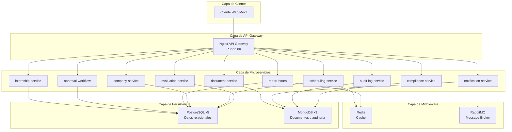
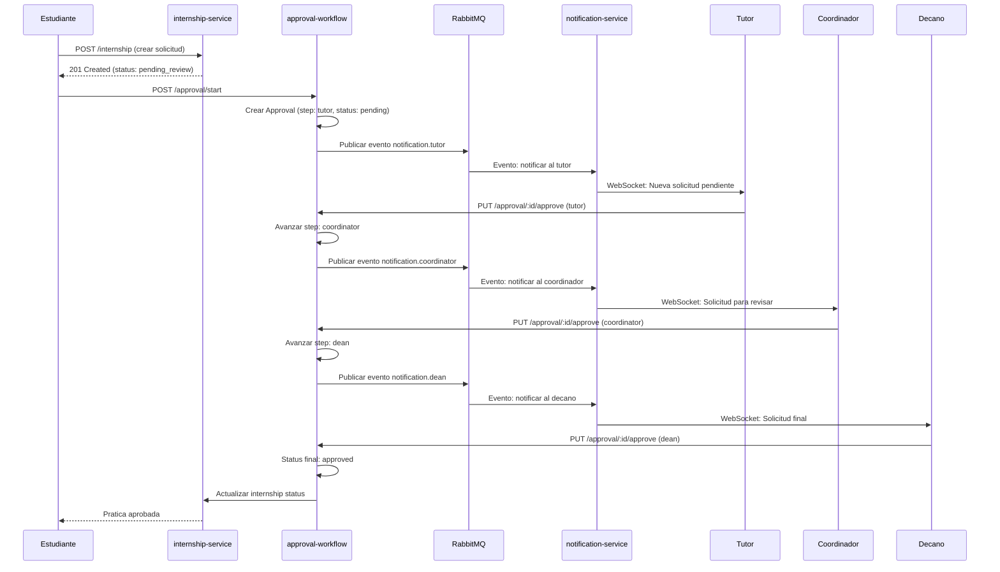
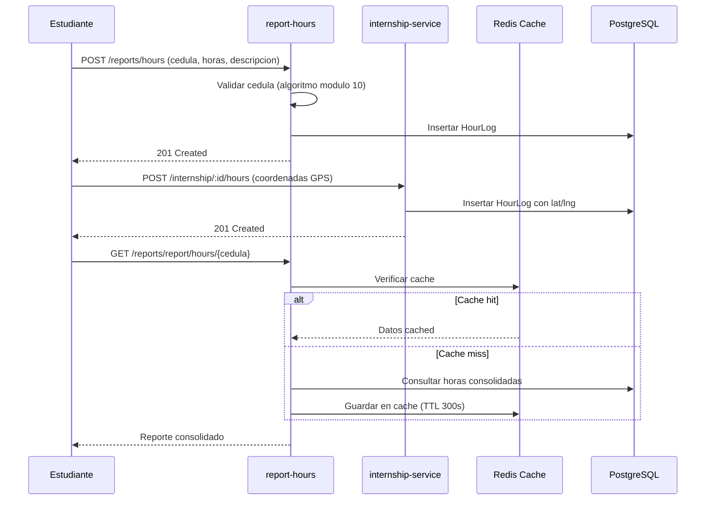
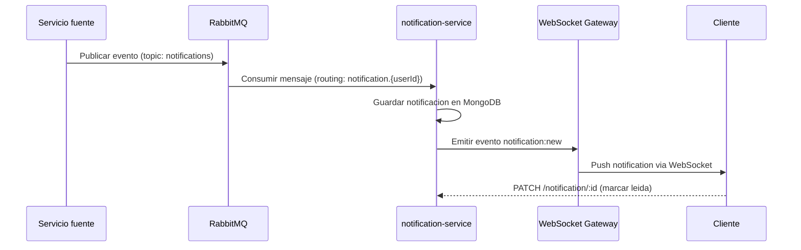
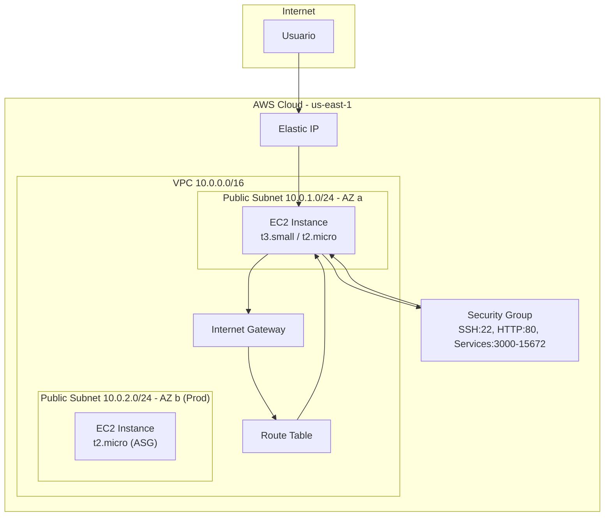

# Arquitectura del Sistema — Smart Campus UCE Modulo 5

## Diagrama de Componentes

## Diagrama de Secuencia — Flujo de Aprobacion Multinivel

## Diagrama de Secuencia — Registro de Horas

## Diagrama de Secuencia — Notificaciones en Tiempo Real

## Topologia de Red — AWS

## Patrones Arquitectonicos

### Microservicios
Cada servicio es desplegable independientemente, tiene su propia base de datos, y se comunica via REST API a traves del API Gateway.

| Servicio | Responsabilidad | Base de Datos | Patron |
|---|---|---|---|
| internship-service | Practicas y horas | PostgreSQL | CRUD |
| document-service | Documentos institucionales | MongoDB | File Storage |
| approval-workflow | Aprobacion multinivel | PostgreSQL | State Machine |
| report-hours | Consolidacion y certificados | PostgreSQL | Report Generation |
| notification-service | Notificaciones | MongoDB | Event-Driven |
| company-service | Catalogo de empresas | PostgreSQL | Catalog |
| audit-log-service | Auditoria del sistema | MongoDB | Event Sourcing |
| scheduling-service | Horarios | PostgreSQL | CQRS (cache) |
| evaluation-service | Evaluaciones | PostgreSQL | CRUD |
| compliance-service | Cumplimiento | MongoDB | Status Tracking |

### Event-Driven (RabbitMQ)
- Exchange: `notifications` (topic)
- Routing Key: `notification.{userId}`
- Producer: Servicios que generan eventos (approval-workflow)
- Consumer: notification-service

### CQRS (Command Query Responsibility Segregation)
Implementado implicitamente mediante:
- **Commands**: Endpoints POST/PUT/DELETE para escritura
- **Queries**: Endpoints GET para lectura
- **Read Model**: Redis cache en scheduling-service y report-hours

### API Gateway (Nginx)
- Punto de entrada unico
- Reverse proxy a los 10 microservicios
- Health check en `/health`
- Headers: Host, X-Real-IP para trazabilidad

## Decisiones Arquitectonicas (ADR)

### ADR-001: Monorepo con pnpm workspaces
- **Decision**: Usar monorepo en lugar de repositorios separados
- **Razon**: Facilita desarrollo local, CI/CD compartido, y despliegue atomico
- **Consecuencias**: Acoplamiento entre servicios, pero simplifica el workflow

### ADR-002: Polyglot (NestJS + Python FastAPI)
- **Decision**: Usar NestJS para servicios CRUD y Python para servicios de ML/analytics
- **Razon**: NestJS optimizado para APIs REST, Python para procesamiento de datos y validacion de cedula
- **Consecuencias**: Doble stack de mantenimiento, pero optimizacion por dominio

### ADR-003: PostgreSQL + MongoDB
- **Decision**: PostgreSQL para datos relacionales, MongoDB para documentos y auditoria
- **Razon**: PostgreSQL para integridad referencial (practicas, empresas), MongoDB para flexibilidad (documentos, logs)
- **Consecuencias**: Consistencia en transacciones criticas, flexibilidad en datos semiestructurados

### ADR-004: Docker Compose en lugar de Kubernetes
- **Decision**: Docker Compose para orquestacion
- **Razon**: Proyecto academico, simplicidad de operacion, un solo servidor EC2
- **Consecuencias**: Sin auto-healing ni auto-scaling a nivel de contenedor (usar ASG de AWS)
