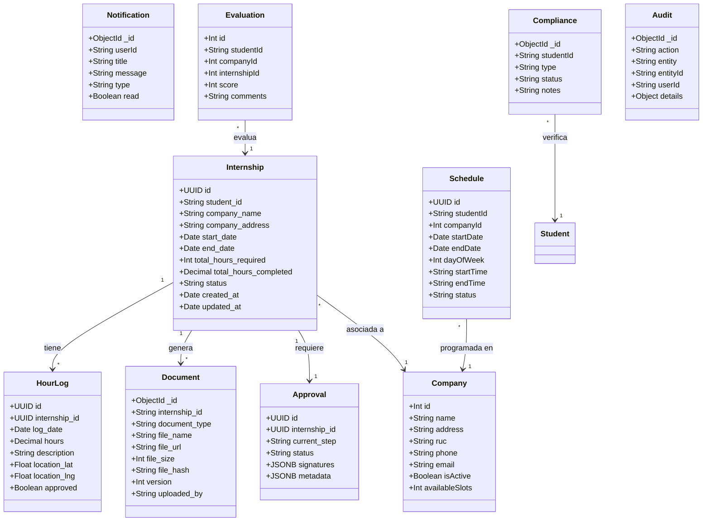
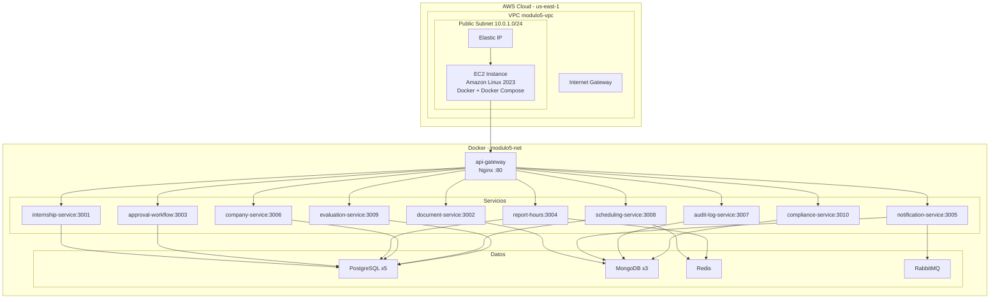
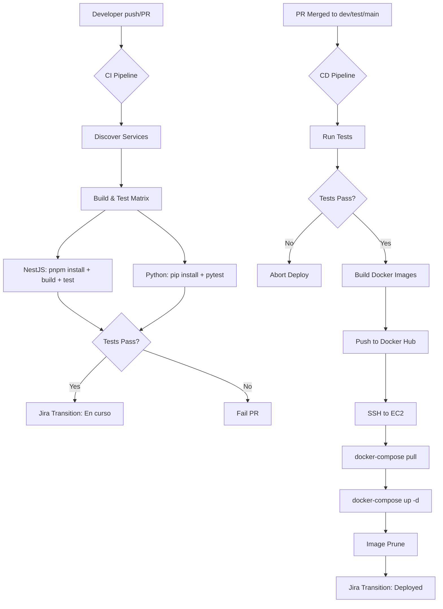
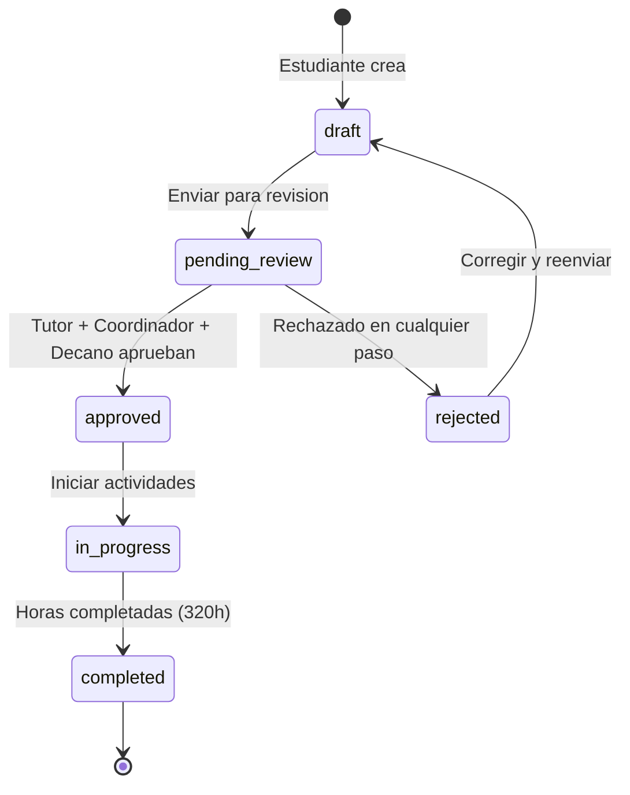
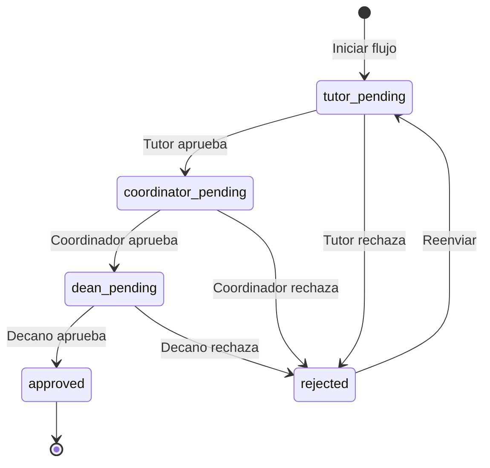
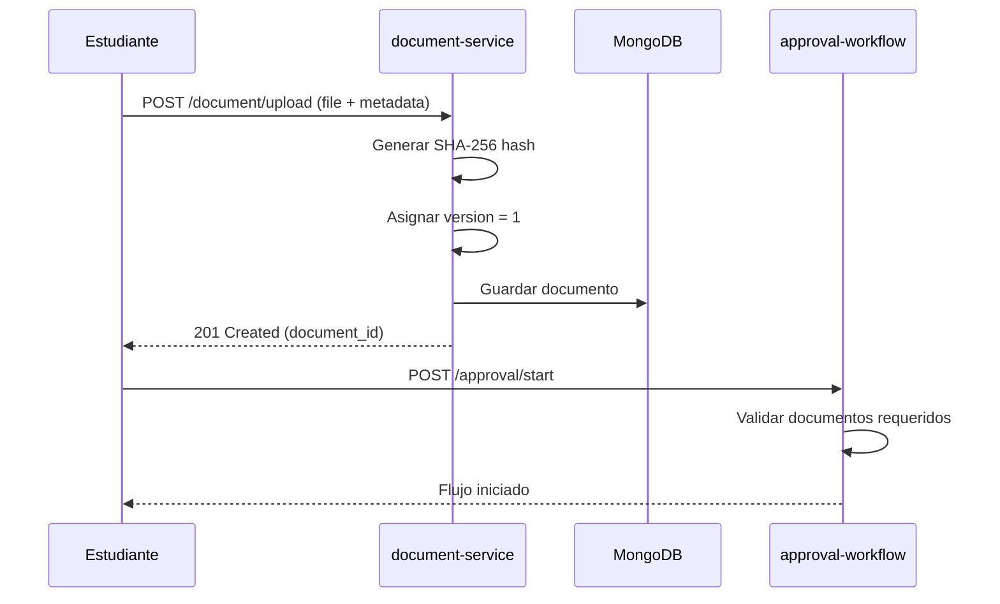
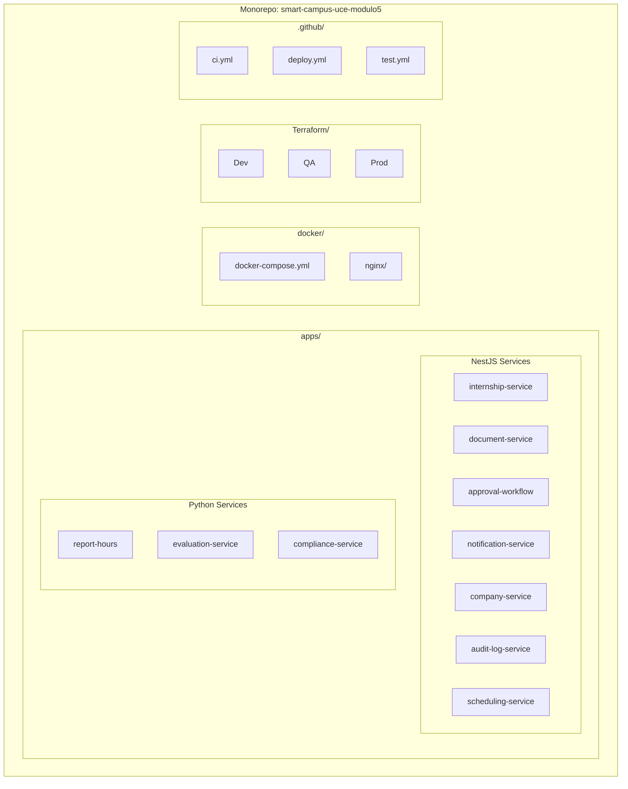

# Diagramas UML — Smart Campus UCE Modulo 5

## Diagrama de Casos de Uso

```mermaid
graph TB
    subgraph "Actores"
        EST[Estudiante]
        TUT[Tutor]
        COORD[Coordinador]
        DEC[Decano]
        ADMIN[Administrador]
    end

    subgraph "Sistema"
        subgraph "Gestion de Practicas"
            CU1[Crear solicitud de practica]
            CU2[Registrar horas diarias]
            CU3[Ver practicas propias]
            CU4[Subir documentos]
            CU5[Ver documentos propios]
        end

        subgraph "Aprobacion"
            CU6[Revisar solicitud 1er nivel]
            CU7[Revisar solicitud 2do nivel]
            CU8[Revisar solicitud final]
            CU9[Ver estado de aprobacion]
        end

        subgraph "Reportes y Evaluacion"
            CU10[Ver reporte de horas]
            CU11[Generar certificado PDF]
            CU12[Evaluar estudiante]
            CU13[Ver evaluaciones]
        end

        subgraph "Gestion Administrativa"
            CU14[Gestionar empresas]
            CU15[Ver auditoria]
            CU16[Gestionar horarios]
            CU17[Ver cumplimiento]
        end

        subgraph "Notificaciones"
            CU18[Recibir notificaciones]
            CU19[Marcar como leida]
        end
    end

    EST --> CU1 & CU2 & CU3 & CU4 & CU5 & CU9 & CU10 & CU18 & CU19
    TUT --> CU6 & CU9 & CU13
    COORD --> CU7 & CU9 & CU10 & CU13
    DEC --> CU8 & CU9 & CU10 & CU13
    ADMIN --> CU14 & CU15 & CU16 & CU17 & CU10
```

## Diagrama de Clases (Simplificado)

## Diagrama de Despliegue

## Diagrama de Flujo — CI/CD

## Diagrama de Estados — Practica Preprofesional

## Diagrama de Estados — Flujo de Aprobacion

## Diagrama de Secuencia — Subida de Documentos

## Diagrama de Paquetes

